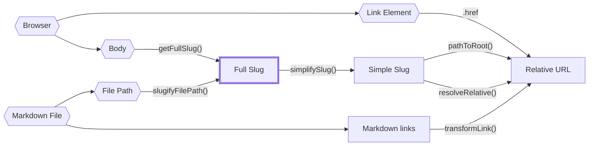

경로는 따져보기가 꽤 복잡한데, 특히 정적 사이트 생성기에서는 경로가 아주 많은 곳에서 올 수 있기 때문이다.

콘텐츠 파일의 전체 파일 경로? 이것도 경로다. 콘텐츠의 slug는? 이것 역시 또 다른 경로다.

이것들을 전부 `string`으로 타이핑하고 끝내는 것은 어리석은 일인데, 한 종류의 경로를 다른 종류로 실수로 혼동하는 일이 꽤 흔하기 때문이다. 불행히도 TypeScript의 타입 별칭에는 [명목적 타입(nominal type)](https://en.wikipedia.org/wiki/Nominal_type_system)이 없어서, 서버 측 slug와 클라이언트 측 slug를 위한 커스텀 타입을 만들더라도 여전히 실수로 하나를 다른 하나에 할당할 수 있고 TypeScript는 이를 잡아내지 못한다.

다행히 [브랜드(brand)](https://www.typescriptlang.org/play#example/nominal-typing)를 사용해 명목적 타이핑을 흉내 낼 수 있다.

```typescript
// instead of
type FullSlug = string

// we do
type FullSlug = string & { __brand: "full" }

// that way, the following will fail typechecking
const slug: FullSlug = "some random string"
```

이렇게 하면 명목적 타이핑 시스템 _안에서의_ 타이핑 실수(예: 서버 slug를 클라이언트 slug로 혼동하는 것)는 대부분 방지되지만, 강제로 캐스팅할 때 문자열을 클라이언트 slug로 _실수로_ 혼동하는 것까지 막아주지는 못한다.

따라서 '진입점'에서 문자열을 이러한 명목적 타입 중 하나로 캐스팅할 때는 여전히 주의해야 한다. 진입점은 아래 다이어그램에서 육각형 모양으로 표시되어 있다.

다음 다이어그램은 모든 경로 출처, 명목적 경로 타입, 그리고 `quartz/path.ts`의 어떤 함수가 이들 사이를 변환하는지의 관계를 그린 것이다.



다음은 주요 slug 타입들과 각 경로 타입에 대한 대략적인 설명이다:

- `FilePath`: 디스크에 있는 파일의 실제 파일 경로. 상대 경로일 수 없고 파일 확장자가 있어야 한다.
- `FullSlug`: 상대 경로일 수 없으며 앞뒤에 슬래시가 붙을 수 없다. 마지막 세그먼트로 `index`를 가질 수 있다. slug의 가장 '일반적인' 해석이므로 가능한 한 이것을 사용하라.
- `SimpleSlug`: 상대 경로일 수 없으며 끝에 `/index`나 파일 확장자가 붙으면 안 된다. 다만 폴더 경로를 나타내기 위해 뒤에 슬래시가 붙을 수는 _있다_.
- `RelativeURL`: 상대 URL임을 나타내기 위해 반드시 `.` 또는 `..`으로 시작해야 한다. 끝에 `/index`나 파일 확장자가 붙으면 안 되지만 뒤에 슬래시는 포함할 수 있다.

이들이 서로 어떻게 관련되는지 더 명확히 이해하려면 `quartz/util/path.test.ts`의 경로 테스트를 살펴보라.
